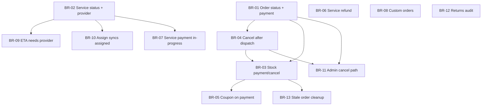

# Business Rules & Validation Guardrails — TODO

> Formal backlog for status transitions, payment/provider gates, inventory, and related integrity checks.  
> **Work one item at a time** — mark status as you go. Backend enforcement is required for every item; UI hints are additive.

**Last updated:** 2026-07-07

---

## How to use this doc

1. Pick the next item in **Implementation order** (or the lowest open P0).
2. Implement **backend validation first**, then admin/customer UI.
3. Update this file: change `Status` from `pending` → `in_progress` → `done`.
4. Add a one-line note under **Session log** at the bottom when an item ships.
5. Do **not** replace `projectplan.md` — this file tracks operational guardrails only.

**Status values:** `pending` | `in_progress` | `done` | `deferred`

---

## Principles (apply to all items)

- **API is the source of truth** — never rely on disabled dropdowns alone.
- **Clear error messages** — tell admin *why* a transition was blocked.
- **Emails must match reality** — don’t notify “dispatched” or “provider assigned” if rules aren’t met.
- **Malawi context** — landmark pickup, PayChangu payments, vetted providers.

---

## P0 — Business integrity (do first)

### BR-01 — Order status transitions + payment gating

| Field | Detail |
|-------|--------|
| **Status** | `done` |
| **Problem** | Admin can set any order status anytime; e.g. `dispatched` while `paymentStatus` is `pending` or `failed`. |
| **Rules** | |
| | • `processing`, `dispatched`, `ready_for_collection`, `completed` require `paymentStatus === completed` |
| | • Forward-only step order: `pending` → `processing` → `dispatched` → `ready_for_collection` → `completed` (no skips) |
| | • `cancelled` allowed from non-terminal states (see BR-04 for customer cancel window) |
| | • Block backwards moves (e.g. `completed` → `processing`) unless explicit future “reopen” flow |
| **Backend** | `assertValidOrderStatusTransition()` in shared util; call from `updateOrderStatus` in [`backend/src/controllers/orderController.ts`](backend/src/controllers/orderController.ts) |
| **Frontend** | Filter/disable invalid options in admin [`frontend/src/pages/OrderDetail.tsx`](frontend/src/pages/OrderDetail.tsx); show helper text |
| **Acceptance** | API returns `400` with message if unpaid dispatch attempted; admin UI reflects same rules |

---

### BR-02 — Service status + provider gating

| Field | Detail |
|-------|--------|
| **Status** | `done` |
| **Problem** | `assigned`, `in-progress`, `completed` can be set without `assignedDriver` / `assignedMechanic`. |
| **Rules** | |
| | • `assigned`, `in-progress`, `completed` require provider assigned |
| | • Forward flow: `pending` → `assigned` → `in-progress` → `completed` (no skips) |
| | • `cancelled` from non-terminal per existing policy |
| **Backend** | `assertValidServiceStatusTransition()`; use in `updateCarService` and `updateTowingService` |
| **Frontend** | Admin [`frontend/src/pages/admin/Services.tsx`](frontend/src/pages/admin/Services.tsx) — disable invalid status options; warn if no provider |
| **Acceptance** | Cannot mark `assigned` without provider; emails don’t say “provider assigned” with empty assignee |

---

### BR-03 — Stock: deduct on payment, restore on cancel

| Field | Detail |
|-------|--------|
| **Status** | `done` |
| **Problem** | Stock decremented at order **create** ([`orderController.ts`](backend/src/controllers/orderController.ts) ~L124); never restored on cancel; unpaid orders hold inventory. |
| **Rules** | |
| | • **Option A (recommended):** Soft-reserve on create, hard deduct on `paymentStatus === completed`; release reserve on cancel/timeout |
| | • **Option B (simpler MVP):** Keep deduct on create but **restore stock** on cancel when order not yet `dispatched` |
| | • **Implemented:** Option B in [`backend/src/utils/orderStock.ts`](backend/src/utils/orderStock.ts) |
| **Backend** | `orderController` create/cancel; `paymentController` on payment success |
| **Frontend** | None required if API enforces; optional admin note on cancel |
| **Acceptance** | Cancelling unpaid `pending` order restores stock; paid + dispatched cancel policy aligned with BR-04 |
| **Depends on** | Decide with BR-04 (when cancel is allowed) |

---

### BR-04 — Restrict order cancellation after dispatch

| Field | Detail |
|-------|--------|
| **Status** | `done` |
| **Problem** | Customer can cancel through `processing` and new pickup statuses (`dispatched`, `ready_for_collection`); UI shows Cancel for all non-completed orders. |
| **Rules** | |
| | • Customer cancel allowed only: `pending`, `processing` (and unpaid — align with BR-01) |
| | • Block cancel once `dispatched` or later |
| | • Admin cancel may need separate path with refund + stock rules (see BR-11) |
| **Backend** | [`cancelOrder`](backend/src/controllers/orderController.ts) |
| **Frontend** | Hide/disable Cancel on [`OrderDetail.tsx`](frontend/src/pages/OrderDetail.tsx) when too late |
| **Acceptance** | Customer cannot cancel after dispatch; clear message to contact support |
| **Depends on** | BR-03 for stock restore on allowed cancels |

---

## P1 — Money & trust

### BR-05 — Coupon usage only after successful payment

| Field | Detail |
|-------|--------|
| **Status** | `completed` |
| **Problem** | `coupon.usageCount` increments at order create even if payment never completes. |
| **Rules** | Increment coupon usage when payment completes (increment-on-pay only); userLimit counts paid orders only |
| **Backend** | [`orderController.ts`](backend/src/controllers/orderController.ts) create; [`paymentController.ts`](backend/src/controllers/paymentController.ts) on success; `utils/couponUsage.ts` |
| **Acceptance** | Abandoned checkout does not consume coupon quota |

---

### BR-06 — Service / order refund on cancel (PayChangu manual)

| Field | Detail |
|-------|--------|
| **Status** | `completed` |
| **Problem** | PayChangu has no refund API; paid cancels must not pretend to auto-refund. |
| **Rules** | If payment `completed`, queue `refund_pending`; admin refunds in PayChangu dashboard then marks completed in AutoTek; cancel still succeeds if queue fails; customer message: 3–5 business days |
| **Backend** | `utils/paymentRefunds.ts`, `utils/serviceCancelRefund.ts`, order/car/towing cancel, `GET/PATCH /api/admin/refunds` |
| **Frontend** | Admin → Refunds (`/admin/refunds`) |
| **Acceptance** | Paid cancel creates pending refund; admin can mark completed after dashboard refund; customer notified on complete |

---

### BR-07 — Service payment before `in-progress`

| Field | Detail |
|-------|--------|
| **Status** | `pending` |
| **Problem** | Work can be marked `in-progress` / `completed` while `paymentStatus` is still `pending`. |
| **Rules** | |
| | • `in-progress` and `completed` require `paymentStatus === completed` (if pay-before-work policy — **confirm with ops**) |
| | • `assigned` may be allowed before payment (quote then pay) |
| **Backend** | Part of BR-02 transition helper |
| **Frontend** | Admin Services — show payment status near status dropdown |
| **Acceptance** | Cannot start job without payment if policy confirmed |
| **Note** | Confirm business rule: pay before dispatch to provider vs pay before work starts |

---

## P2 — Consistency & admin UX

### BR-08 — Custom order status rules

| Field | Detail |
|-------|--------|
| **Status** | `pending` |
| **Problem** | [`updateCustomOrder`](backend/src/controllers/customOrderController.ts) allows any enum value anytime. |
| **Rules** | |
| | • `ordered` / `received` / `completed` — define required fields (`estimatedPrice`, `supplier`, etc.) |
| | • Forward-only: `pending` → `ordered` → `received` → `completed` |
| **Backend** | `customOrderController.ts` |
| **Frontend** | [`frontend/src/pages/admin/CustomOrders.tsx`](frontend/src/pages/admin/CustomOrders.tsx) |
| **Acceptance** | Cannot complete custom order without price (or defined minimum data) |

---

### BR-09 — ETA requires assigned provider

| Field | Detail |
|-------|--------|
| **Status** | `completed` |
| **Problem** | Admin can save ETA without provider; customer gets “on the way” with no name. |
| **Rules** | `estimatedArrivalAt` requires `assignedDriver` / `assignedMechanic`; clearing provider also clears ETA |
| **Backend** | `updateCarService`, `updateTowingService` + `shared/utils/serviceEtaRules.ts` |
| **Frontend** | [`admin/Services.tsx`](frontend/src/pages/admin/Services.tsx) — disable ETA controls without provider |
| **Acceptance** | ETA save blocked without provider |

---

### BR-10 — Auto-sync provider assignment → `assigned` status

| Field | Detail |
|-------|--------|
| **Status** | `completed` |
| **Problem** | “Save assignment & ETA” and “Update Status” are separate; data drifts. |
| **Rules** | When provider saved and status is `pending`, auto-set `assigned`; unassign from `assigned` returns to `pending`; cannot unassign while `in-progress` |
| **Backend** | Assignment save handlers + `shared/utils/serviceAssignmentStatusSync.ts` |
| **Frontend** | [`admin/Services.tsx`](frontend/src/pages/admin/Services.tsx) — helper copy + success toast |
| **Acceptance** | Assigning provider moves service to `assigned` when appropriate |
| **Depends on** | BR-02 |

---

### BR-11 — Admin setting `cancelled` on orders must use refund/stock path

| Field | Detail |
|-------|--------|
| **Status** | `pending` |
| **Problem** | Admin can set status to `cancelled` via `updateOrderStatus` without running refund/stock logic that `cancelOrder` uses. |
| **Rules** | `cancelled` via status update should call shared `cancelOrderSideEffects()` or reject and force use of cancel endpoint |
| **Backend** | `orderController.ts` |
| **Acceptance** | Admin cancel always triggers refund (if paid) and stock restore per BR-03/BR-04 |
| **Depends on** | BR-01, BR-03, BR-04 |

---

## P3 — Polish & automation

### BR-12 — Return flow alignment with “collected” orders

| Field | Detail |
|-------|--------|
| **Status** | `pending` |
| **Problem** | Returns require `order.status === completed` (collected). Mostly correct; verify copy and admin training. |
| **Rules** | Audit return eligibility vs new order statuses; ensure only **collected** orders can return |
| **Backend** | [`returnController.ts`](backend/src/controllers/returnController.ts) — already checks `COMPLETED` |
| **Acceptance** | Docs/UI say “collected” not “delivered”; no return on `ready_for_collection` |

---

### BR-13 — Expire / clean up stale unpaid orders

| Field | Detail |
|-------|--------|
| **Status** | `done` |
| **Problem** | `paymentStatus: pending` orders can sit forever with stock reserved (until BR-03). |
| **Rules** | Cron or scheduled job: auto-cancel unpaid orders after N hours; release stock; optional email |
| **Backend** | [`backend/src/jobs/expireStaleUnpaidOrders.ts`](backend/src/jobs/expireStaleUnpaidOrders.ts), scheduler in [`server.ts`](backend/src/server.ts), CLI `npm run jobs:expire-stale-orders` |
| **Acceptance** | Orders unpaid > 24–48h auto-cancelled (N configurable via `STALE_UNPAID_ORDER_HOURS`) |
| **Depends on** | BR-03 |

---

### BR-14 — Status change audit trail (optional)

| Field | Detail |
|-------|--------|
| **Status** | `deferred` |
| **Problem** | No history of who changed status and when (only `updatedAt`). |
| **Rules** | `statusHistory[]` on Order / Service or admin activity log |
| **Acceptance** | Admin can see last 5 status changes on detail view |

---

## Implementation order (recommended)

| Step | ID | Title |
|------|-----|-------|
| 1 | **BR-01** | Order status transitions + payment gating |
| 2 | **BR-02** | Service status + provider gating |
| 3 | **BR-04** | Restrict customer cancel after dispatch |
| 4 | **BR-03** | Stock deduct/restore policy |
| 5 | **BR-09** | ETA requires provider |
| 6 | **BR-10** | Assign provider → `assigned` status |
| 7 | **BR-05** | Coupon usage on payment success |
| 8 | **BR-07** | Service payment before in-progress |
| 9 | **BR-06** | Service refund on cancel |
| 10 | **BR-11** | Admin cancel uses refund/stock path |
| 11 | **BR-08** | Custom order status rules |
| 12 | **BR-12** | Returns / collected wording audit |
| 13 | **BR-13** | Stale unpaid order cleanup (deferred) |
| 14 | **BR-14** | Audit trail (deferred) |

---

## Shared implementation pattern

For each BR item:

1. Add validator in `backend/src/utils/` (e.g. `orderStatusTransitions.ts`, `serviceStatusTransitions.ts`).
2. Unit-test validators if test suite exists; otherwise manual test checklist in PR.
3. Return `400` with `{ message: '...' }` from controller.
4. Mirror rules in admin UI (disabled options + helper text).
5. Update this doc status + session log.

---

## Related completed work

- Pickup statuses `dispatched`, `ready_for_collection` — see [`STATUS_UPDATES_PLAN.md`](STATUS_UPDATES_PLAN.md) (implemented).
- Service status emails + My Services copy — implemented.
- Customer `/orders` cache refresh (refetch/poll) — implemented.
- Admin ETA split date/time + presets — implemented.

---

## Session log

| Date | Item | Notes |
|------|------|-------|
| 2026-07-07 | — | Created `BUSINESS_RULES_TODO.md`; backlog defined, no items started |
| 2026-07-07 | BR-01 | Order status transitions + payment gating (shared util, API 400, admin dropdown) |
| 2026-07-07 | BR-02 | Service status + provider gating (shared util, car/towing controllers, admin Services dropdown) |
| 2026-07-07 | BR-04 | Restrict customer order cancel after dispatch (shared util, cancelOrder API, OrderDetail UI) |
| 2026-07-07 | BR-03 | Stock restore on cancel — Option B (deduct on create, restore on allowed cancel) |
| 2026-07-08 | BR-13 | Auto-cancel stale unpaid orders (scheduler + CLI, stock restore, optional email) |
| 2026-07-13 | BR-09 | ETA requires assigned provider (shared rule, car/towing API 400, admin Services UI) |
| 2026-07-13 | BR-10 | Auto-sync provider assignment with assigned/pending status |
| 2026-07-13 | BR-05 | Coupon usageCount increments only after payment success |
| 2026-07-13 | BR-06 | Service cancel triggers PayChangu refund for paid towing/car services |
| 2026-07-15 | BR-06 | Aligned to manual PayChangu refunds: `refund_pending` queue + Admin Refunds page |

---

## Open decisions (resolve before or during BR-01 / BR-03 / BR-07)

1. **Stock policy:** Option B + BR-13 auto-cancel unpaid orders after `STALE_UNPAID_ORDER_HOURS` (default 48h); Option A deferred unless inventory issues arise
2. **Service pay timing:** Must customer pay before `in-progress`, or only before `completed`? (BR-07)
3. **Offline payment:** Will admin ever mark bank transfer paid manually before dispatch? If yes, need `paymentStatus` override workflow.

---

*Next step: Start **BR-11** (admin cancel side effects) or **BR-07** (service payment before in-progress — needs ops confirm) when ready.*
