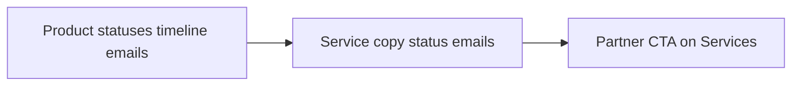

# Status Updates & Partner Intake Plan

> Plan for product pickup milestones, service customer notifications, and provider partner intake.  
> **Status:** Approved for documentation — implementation pending user confirmation.

---

## Context

AutoTek operates in Malawi with **landmark-based pickup** for product orders (not door-to-door live tracking) and **human providers** (mechanics, drivers) for towing and at-home car services. This plan adds clear customer-facing milestones without GPS/live tracking, plus lightweight partner intake.

---

## 1. Product orders — pickup milestones

### Goal

Tell buyers when their order is:
1. **On the way** to the pickup landmark/hub
2. **Ready for collection** at that landmark
3. **Picked up** (case closed)

### Status model

Extend `OrderStatus` with two new values. Final flow:

| Status | Admin meaning | Customer message (example) |
|--------|---------------|----------------------------|
| `pending` | Order received | "Your order has been received." |
| `processing` | Being prepared | "We're preparing your order." |
| `dispatched` | **(new)** Courier en route to pickup point | "Your order is on the way to **[Town, Landmark]** for pickup." |
| `ready_for_collection` | **(new)** Arrived at hub/landmark | "Your order is **ready for collection** at **[Landmark]**." |
| `completed` | Customer collected / case closed | "Your order has been collected. Thank you." |
| `cancelled` | Cancelled | (existing behaviour) |

**Decision:** `ready_for_collection` = customer-facing "come pick up"; `completed` = admin marks **picked up** / closed.

### Customer touchpoints

- **Order detail timeline** (`frontend/src/pages/OrderDetail.tsx`) — new steps, pickup wording (not "delivered to your door")
- **Orders list** — status badges/labels for new statuses
- **Email** (`backend/src/services/emailService.ts`) — templates for `dispatched`, `ready_for_collection`, updated `completed` copy; include `town` + `landmark` from `shippingAddress`
- **Admin** — status dropdown on order detail includes new options

### Backend / shared types

- Add `DISPATCHED` and `READY_FOR_COLLECTION` to `OrderStatus` in:
  - `shared/types/index.ts`
  - `backend/src/types/shared/index.ts`
- Validate new values in `updateOrderStatus` (`backend/src/controllers/orderController.ts`)
- **No data migration** — existing `processing` / `completed` orders remain valid

### Out of scope (v1)

- Live GPS / courier API
- SMS notifications
- Tracking numbers

---

## 2. Services (towing / mechanic) — Option A + emails

### Goal

Customers are clearly informed when:
1. A provider has been **assigned**
2. The provider is **on the way** (with estimated arrival)
3. The provider has **started** the job
4. The job is **finished**

### Approach: Option A (no new status)

Keep existing `ServiceStatus` enum:

| Status | Customer-facing meaning |
|--------|-------------------------|
| `pending` | "We're finding a provider for you." |
| `assigned` (no ETA) | "Provider assigned: **[name]**. We'll confirm when they're on the way." |
| `assigned` (with `estimatedArrivalAt`) | "**[Name]** is on the way. Estimated arrival: **[time]**." |
| `in-progress` | "Your provider has started the job." |
| `completed` | "Your service is complete." |
| `cancelled` | (existing) |

**Rule:** "On the way" is implied when status is `assigned` and `estimatedArrivalAt` is set (admin sets ETA in Admin → Services).

### UI changes

- **`frontend/src/pages/MyServices.tsx`** — improve `statusGuidance`, timeline-style steps, conditional copy for assigned ± ETA
- Show assigned provider name, phone, garage (already partially present)
- Show estimated arrival when set (already partially present)

### Status-change emails (new)

Send emails on admin updates to towing and car services (mirror order status emails):

| Trigger | Email intent |
|---------|----------------|
| Status → `assigned` | Provider assigned (include name, garage if available) |
| `estimatedArrivalAt` set/updated while `assigned` | Provider on the way + ETA |
| Status → `in-progress` | Work started |
| Status → `completed` | Job complete |
| Status → `cancelled` | Service cancelled |

**Implementation:**
- Add `sendServiceStatusUpdate()` (or similar) in `backend/src/services/emailService.ts`
- Call from `updateCarService` and `updateTowingService` in admin update paths (`backend/src/controllers/carServiceController.ts`, `backend/src/controllers/towingServiceController.ts`)
- Link to `/my-services` in email body

**Note:** Emails require configured SendGrid/SMTP; dev falls back to console logging (same as orders today).

### Out of scope (v1)

- New `en_route` status
- Dedicated `/my-services/:id` detail page (optional later)
- SMS / push notifications

---

## 3. Provider applications — staged intake

### Goal

Give garages/mechanics a clear way to express interest without building a full self-onboarding portal yet.

### Phase 1 — Now (this implementation)

**Partner CTA** on public surfaces (at minimum **Services** page; optionally site footer):

- Headline: e.g. "Partner with AutoTek"
- Short copy: mechanics, garages, and towing partners welcome
- Contact paths:
  - WhatsApp (if business number available)
  - Phone
  - `support@autotek.mw` with suggested subject "Partner application"
- Checklist for applicants: garage/business name, town, services offered, phone/WhatsApp

**No backend** — admin continues to add partners manually via **Admin → Providers**.

### Phase 2 — Later (not in this implementation)

- Public `ProviderApplication` form → `pending_review` → admin approve → create `Garage` + `ServiceProvider`
- Build when manual onboarding becomes repetitive (e.g. several inbound requests per week)

### Out of scope (v1)

- Document upload, vetting workflow UI, provider login portal

---

## Implementation order

1. **Product statuses** — enum, admin UI, timeline, emails (highest impact for shop buyers)
2. **Service copy + status emails** — reuses email patterns from step 1
3. **Partner CTA** — small frontend/copy change, no backend

---

## Key files (expected)

| Area | Files |
|------|--------|
| Shared types | `shared/types/index.ts`, `backend/src/types/shared/index.ts` |
| Orders backend | `backend/src/controllers/orderController.ts`, `backend/src/services/emailService.ts` |
| Orders frontend | `frontend/src/pages/OrderDetail.tsx`, `frontend/src/pages/Orders.tsx`, `frontend/src/pages/admin/Orders.tsx` |
| Services backend | `backend/src/controllers/carServiceController.ts`, `backend/src/controllers/towingServiceController.ts`, `backend/src/services/emailService.ts` |
| Services frontend | `frontend/src/pages/MyServices.tsx`, `frontend/src/pages/admin/Services.tsx` |
| Partner CTA | `frontend/src/pages/Services.tsx` (and optionally layout/footer) |

---

## Risks & mitigations

| Risk | Mitigation |
|------|------------|
| Admin forgets to update status | Short helper text in admin status UI on when to use each step |
| Enum drift frontend/backend | Update shared types in one pass |
| Guest order emails | Reuse existing guest email path in order status emails |
| Email not configured in dev | Console logging; document in test steps |

---

## Manual test checklist

### Product orders
- [ ] Admin can set `dispatched`, `ready_for_collection`, `completed`
- [ ] Customer order detail timeline shows correct steps and landmark text
- [ ] Status emails sent (or logged) for new statuses
- [ ] Existing orders with old statuses still display correctly

### Services
- [ ] Assigned without ETA shows "assigned" messaging
- [ ] Assigned with ETA shows "on the way" + time
- [ ] `in-progress` and `completed` copy clear on My Services
- [ ] Status-change emails on admin update (assign, ETA, start, complete, cancel)

### Partner CTA
- [ ] CTA visible on Services page
- [ ] Links/contact details work

---

## Suggested commits (after implementation)

1. `feat: add dispatched and ready-for-collection order statuses`
2. `feat: send service status update emails and improve My Services copy`
3. `feat: add partner-with-AutoTek CTA on services page`

---

*Document created: 2026-06-25*
